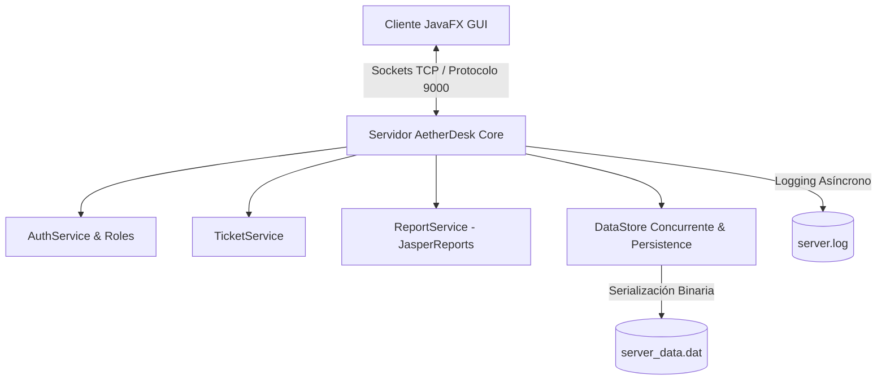

<div align="center">
  <h1>🎫 AetherDesk</h1>
  <p><strong>Sistema de Gestión de Tickets de Soporte Técnico Cliente-Servidor multihilo y ligero desarrollado con Java 22, JavaFX y Sockets TCP.</strong></p>

  <p>
    
    
    
    
    
  </p>
</div>

---

## 🏛️ Arquitectura & Stack Tecnológico

AetherDesk está diseñado siguiendo una arquitectura **Cliente-Servidor desacoplada** mediante un protocolo propio sobre sockets TCP:



### Tecnologías Clave
- **Lenguaje Core:** Java 22 (aprovechando características modernas del JDK).
- **Interfaz Gráfica (Cliente):** JavaFX 22 con FXML y CSS personalizado para dashboards e interacción responsiva.
- **Red & Concurrencia:** Sockets TCP con `ThreadPoolExecutor` asíncrono para gestionar múltiples conexiones en tiempo real.
- **Persistencia de Datos:** Sistema de serialización rápida en Java orientado a objetos thread-safe con `Collections.synchronizedList`.
- **Generación de Reportes:** JasperReports 6.21.0 para generación y exportación en formato analítico.
- **Gestor de Proyectos & Dependencias:** Apache Maven.

---

## ✨ Características Principales

- 🔐 **Autenticación Basada en Roles:** Acceso diferenciado para Administradores (`ADMIN`) y Operadores (`USER`).
- ⚡ **Comunicación en Tiempo Real:** Intercambio instantáneo de comandos (creación, edición, consulta y estado de tickets) a través de sockets de baja latencia.
- 📋 **Gestión del Ciclo de Vida de Tickets:** Creación, asignación, actualización de estados y resolución de incidentes técnicos.
- 📊 **Reportes JasperReports:** Exportación dinámica de informes ejecutivos sobre el volumen y estado de incidencias.
- 💾 **Persistencia Automática:** Autogualdado de datos en disco sin necesidad de instalar bases de datos relacionales complejas.
- ⚙️ **Configuración Flexible:** Personalización de puerto y credenciales iniciales mediante variables de entorno o archivo `config.properties`.

---

## 🚀 Inicio Rápido

### Requisitos Previos
Asegúrate de contar con las siguientes herramientas instaladas en tu sistema:
- **Java Development Kit (JDK):** Versión 22 o superior.
- **Apache Maven:** Versión 3.8 o superior.

---

### ⚙️ 1. Configuración de Credenciales y Entorno

Por seguridad, las credenciales del servidor se configuran de forma externa. Puedes usar un archivo de propiedades o variables de entorno:

#### Opción A: Archivo `config.properties`
Copia la plantilla de ejemplo y ajusta tus credenciales:
```bash
cp config.properties.example config.properties
```

#### Opción B: Variables de Entorno
```bash
export AETHER_ADMIN_USER="mi_administrador"
export AETHER_ADMIN_PASS="SuperPasswordSeguro123!"
```

---

### 💻 2. Ejecutar la Aplicación

#### Opción 1: Scripts Batch (Windows)
1. **Iniciar Servidor**: Haz doble clic en `run-server.bat`
2. **Iniciar Cliente**: Haz doble clic en `run-client.bat`

#### Opción 2: Comandos Maven (Terminal)

**Iniciar Servidor:**
```bash
mvn exec:java -Dexec.mainClass="server.ServerApp"
```

**Iniciar Cliente (Interfaz JavaFX):**
```bash
mvn javafx:run
```

---

## 🔐 Seguridad y Buenas Prácticas

> [!IMPORTANT]
> **Gestión de Datos y Credenciales**
> - Nunca subas contraseñas o archivos `.dat` / `.log` a un repositorio público.
> - El proyecto incluye `.gitignore` configurado para ignorar automáticamente `server_data.dat` y `server.log`.
> - Se recomienda modificar la contraseña del usuario administrador en el primer arranque desde la configuración.

---

## 🛠️ Comandos Útiles de Desarrollo

```bash
# Compilar el código fuente y verificar errores
mvn clean compile

# Generar el paquete ejecutable JAR
mvn package

# Inspeccionar el árbol de dependencias
mvn dependency:tree
```